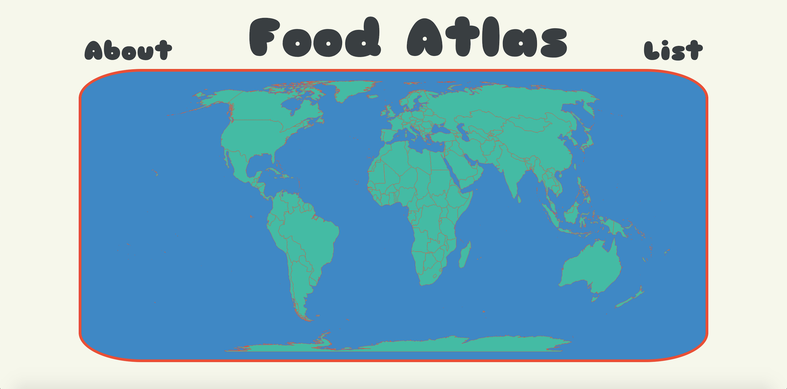

 # Food Atlas


Mini web app built with React that combines three of my greatest loves: travel, geography and food! This app allows you to explore the national dish of each country through an interactive world map.

**PLEASE NOTE** that data is still in the process of being added to the app so not all countries' dishes are currently available.

## Features
This app utilises [React Simple Maps](https://www.react-simple-maps.io/) for the interactive map component as well as [react-tooltip](https://www.npmjs.com/package/react-tooltip) for the tooltips that display when the user hovers over a country. When the user clicks on a country or selects a country from the list, a pop-up will appear containing the name, description, photo and a link to a recipe for the national dish of that country. The user can then navigate back to the world map by clicking the back button.

## Live site

https://laikathespacedog.github.io/food-atlas/#/

## Setup instructions

To get set up with the project:

1.  Run `git clone git@github.com:LaikaTheSpaceDog/food-atlas.git <desired sub-directory>`. The project files will be cloned to your local repo.
2.  Go to your project directory and run `npm install`. This will install the dependencies in the local node_modules folder.
3.  Run `gulp watch`. This will run the below gulp tasks automatically on save.
4.  Run `npm start`. This will run the app in development mode. Open [http://localhost:3000](http://localhost:3000) to view it in the browser. The page will reload if you make any edits. You will also see any lint errors in the console.

### Gulp tasks

- Watch task

  _On start up, in your terminal, run:_

  ```
  gulp watch
  ```
  _This will enable live reloading on save and will also run all the listed gulp tasks below_

- sass -> CSS

  _sass to CSS convertion can be run standalone using:_

  ```
  gulp sass
  ```

- minify CSS

  _CSS compression can be run standalone using:_

  ```
  gulp minify-css
  ```
- minify sass
  
  _Run sass and minify-css tigether using:_
    ```
  gulp minify-sass
  ```